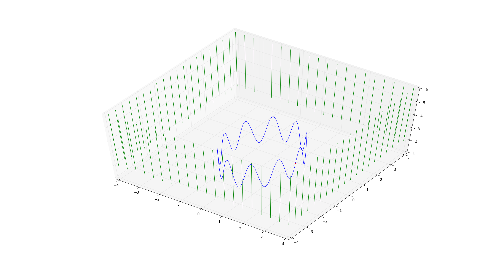

# [PLS-VIO] Comparison of 4-parameter orthogonal expression and 2-parameter expression proposed by our paper of line features.

This repository is supplementary material that obtains the simulation code for running and comparison results. The code is the initial version, and it will be improved further in the comming months.



**DemoShow**: [youtube](https://youtu.be/MPf6HufbgdE) or [bilibili](https://www.bilibili.com/video/BV1464y1F7hk/)

[](https://youtu.be/MPf6HufbgdE)

## 1. Prerequisites
1.1 **Ubuntu** and **ROS**

Ubuntu 18.04. ROS Melodic, please google it.

1.2. **Dependency**

Eigen 3.3.4 + OpenCV 3.2+ Cere-solver: [Ceres Installation](http://ceres-solver.org/installation.html), remember to **sudo make install**.

## 2. Build PL-VINS on ROS
Clone the repository and catkin_make (# note that you will create a new workspace named *catkin_plvins*):
```
	mkdir -p ~/catkin_plvins/src    
	cd ~/catkin_plvins/
	catkin_make
	source devel/setup.bash
	echo $ROS_PACKAGE_PATH             # test you have created it successfully
	git clone https://github.com/cnqiangfu/PL-VINS.git
```
**Notice**: before the second catkin_make, you need to go through /PL-VINS/feature_tracker/CMakeLists.txt, see the sign **# Important** in the CMakeLists.txt, and modify two absolute paths to correctly find the modified LSD algorithm. You also need to make sure OpenCV 3.2 there.

```	
	catkin_make
	source devel/setup.bash
```

## 3. Run on EuRoC dataset

Download [EuRoC MAV Dataset](http://projects.asl.ethz.ch/datasets/doku.php?id=kmavvisualinertialdatasets). We suggust you select difficult sequences to test.

run in the ~/catkin_plvins/
```
	roslaunch plvins_estimator plvins_show_linepoint.launch
	rosbag play YOUR_PATH_TO_DATASET/MH_05_difficult.bag
```
or 
```
roslaunch plvins_estimator euroc_fix_extrinsic.launch        #This launch runs without loop
```

Now you should be able to run PL-VINS in the ROS RViZ. 

**Note that**: if you want obtain motion trajectory and compare it to your method. Please modify the ouput paths: /PL-VINS/vins_estimator/src/visualization.cpp (trajectory without loop) and /PL-VINS/pose_graph/src/pose_graph.cpp (trajectory with loop). 

**Note that**:It is an interesting thing we find that different CPU maybe yield different result whether VINS-Mono or PL-VINS, maybe the reason of ROS mechanism. Therefore, we suggest you test or compare methods on your machine by yourself. 


## 4. Related Papers

- **PL-VINS: Real-Time Monocular Visual-Inertial SLAM with Point and Line**.

```
@misc{fu2020plvins,
      title={PL-VINS: Real-Time Monocular Visual-Inertial SLAM with Point and Line Features}, 
      author={Qiang Fu and Jialong Wang and Hongshan Yu and Islam Ali and Feng Guo and Yijia He and Hong Zhang},
      year={2020},
      eprint={2009.07462},
      archivePrefix={arXiv},
      primaryClass={cs.RO}
}
```

This paper is developed based on PL-VIO [1], VINS-Mono [2], and [3].
```
[1] Pl-vio: Tightly-coupled monocular visual-inertial odometry using point and line features

[2] Vins-mono: A robust and versatile monocular visual-inertial state estimator

[3] A robust RGB-D SLAM system with points and lines for low texture indoor environments
```

*If you find aforementioned works helpful for your research, please cite them.*

## 5. Acknowledgements

Thank Dr. Yijia He, Ji Zhao, Yue Guo, Wenhao He, and Kui Yuan(PL-VIO); Dr. Qin Tong, Dr. Peiliang Li, and Prof. Shen (VINS-Mono) very much.

## 6. Licence
The source code is released under [GPLv3](http://www.gnu.org/licenses/) license.
